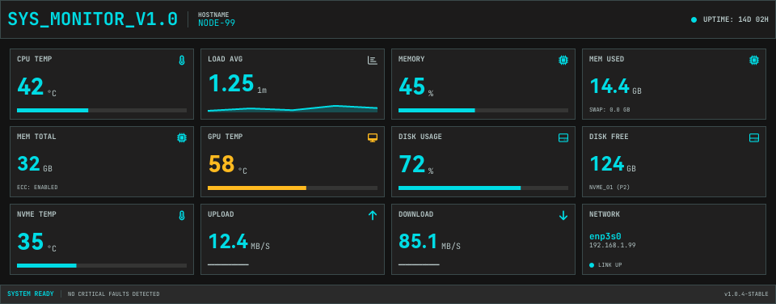

# AOOSTAR WTR MAX / GEM12+ PRO Screen Control

Reverse engineering the [AOOSTAR WTR MAX](https://aoostar.com/products/aoostar-wtr-max-amd-r7-pro-8845hs-11-bays-mini-pc)
display protocol, with a proof-of-concept application written in Rust.  
It has only been tested on the WTR MAX, but should also support the GEM12+ PRO device.

Check out the **[User Guide](https://zehnm.github.io/aoostar-rs)** for a list of features and installation and usage information.

## About This Fork

This fork adds `aster-ui`, a headless widget renderer for building custom
960x376 LCD dashboards without a browser, desktop environment, or graphical
session. Dashboards are declared with TOML and a documented CSS subset, bind
directly to sensor values, and render into the existing `asterctl-lcd`
transport.

The renderer supports reusable components, flex layouts, text, images,
progress bars, graphs, gauges, conditional content, explicit font assets, and
live reload during dashboard development. Existing AOOSTAR-X panel rendering
remains available.

The `ultrawide-monitor` example recreates a dense hardware telemetry dashboard
optimized for the AOOSTAR display:



Render the example to `out/dashboard.png` without connecting an LCD:

```shell
cargo run --bin asterctl -- \
  --dashboard examples/dashboards/ultrawide-monitor/dashboard.toml \
  --sensor-path examples/dashboards/ultrawide-monitor/values.txt \
  --render-once \
  --save
```

See [Widget Dashboards](docs/widget-dashboard.md) for the configuration format,
supported widgets, CSS properties, sensor bindings, and continuous display
mode.

## Features

- Control the AOOSTAR WTR MAX and GEM12+ PRO second screen from Linux.
- Switch the display on or off.
    - Also possible with standard [Linux shell commands](docs/shell_commands.md).
    - [Linux systemd Service](docs/linux/README.md) to automatically switch off the LCD at boot up.
- Display images (with automatic scaling and partial update support).
- Render dynamic sensor panels defined from the AOOSTAR-X software.
    - Update sensor values from simple text files.
    - Rotate through multiple panels in a defined interval.
- Render custom widget dashboards using TOML, CSS, and live sensor bindings.
    - Preview dashboards headlessly as PNG files.
    - Send continuously updated frames to the LCD.
- USB device/serial port selection.

## Disclaimer

> I take no responsibility for the use of this software.  
> There is no official documentation available;
> all display control commands have been reverse engineered from the original AOOSTAR-X software.

Even though this software works fine **for me**, I cannot guarantee that it is risk-free:

- It may or may not work.
- It could crash the display firmware, requiring a power cycle.
- It could even brick the display firmware.
- You have been warned!

The risk remains until the manufacturer provides official documentation, and the protocol can be reviewed.
Note: Multiple attempts to contact the manufacturer for documentation have received no response.

With that out of the way, on to the fun stuff!

- Browse the source code or read the [User Guide](https://zehnm.github.io/aoostar-rs)
- See [releases](https://github.com/zehnm/aoostar-rs/releases) for binary Linux x64 releases. A Debian package for easy installation is planned for the future!

## Contributing

Pull requests are welcome. For major changes, please open an issue first to discuss what you would like to change.

Please note that this software is currently in its initial development and will have major changes until the mentioned
goals above are reached!

## License

Licensed under either of

- Apache License, Version 2.0 ([LICENSE-APACHE](LICENSE-APACHE) or http://www.apache.org/licenses/LICENSE-2.0)
- MIT License ([LICENSE-MIT](LICENSE-MIT) or http://opensource.org/licenses/MIT)

at your option.
